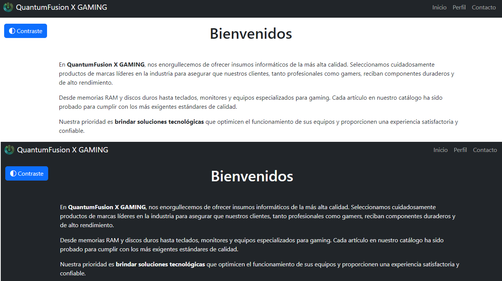

# QuantumFusion X GAMING - Sitio web gammer para ventas de insumos

## Descripción

Este proyecto forma parte de los trabajos prácticos que se van solicitando a lo largo del bootcamp
dictado por Cilsa. Tanto el nombre de la empresa como el contenido son de fantasía y solo es utilizado
con fines de práctica.

## Estructura del sitio

El sitio consta de 3 páginas: Inicio, Perfil y Contacto.

**Inicio**: Posee un mensaje de bienvenida y un carrusel de imágenes de los servicios ofrecidos.
**Perfil**: Contiene la historia de la empresa y detalles de los responsables de la misma, dentro de cards que además permiten la apertura de un modal con más información al respecto (información ficticia).
**Contacto**: En su interior encontramos un formulario de contacto con las validaciones pertinentes en html y javascript, como por ejemplo: evitar que se envien campos vacios, comprobar formato de correo electronico, evitar el ingreso de números en el campo de nombre.

### Navegación

- index.html <==> perfil.html
- index.html <==> contacto.html
- perfil.html <==> contacto.html

## Diseño y estilo

El sitio fue desarrollado prácticamente en su totalidad con **Bootstrap** empleando los colores disponibles en el framework. La barra de navegación y las cards tienen el estilo dark y el footer posee el mismo estilo, pero con una opacidad menor. En cuanto al fondo del contenido principal de cada página, se mantuvo el blanco para que puedan destacarse los elementos presentes en él.
Además se incluyo un botón que permite alternar entre el diseño principal y un contraste alto en todo el sitio, que posee un fondo dark y letras con el estilo light de **Bootstrap**.

## Accesibilidad

El sitio emplea ARIA dentro de sus elementos HTML para ayudar a los lectores de pantalla y demás tecnologías de asistencia a realizar una correcta interpretación cuando no existe otro mecanismo.

## Consignas del trabajo páctico

Crear una página utilizando Bootstrap y los elementos que hemos visto durante las últimas clases.
La página debe incluir lo siguiente:

- **Barra de Navegación**: utiliza la barra de navegación de Bootstrap para crear un menú simple con al menos tres secciones: Inicio, Perfil, y Contacto.

- **Carrusel de Imágenes**: agrega un carrusel con al menos tres imágenes representativas en la sección de _"Inicio"_. Utiliza las clases de Bootstrap para el carrusel y deben asegurarse de **incluir controles de navegación**.

- **Tarjeta de perfil**: En la sección de _"Perfil"_, deben crear una tarjeta con una imagen de perfil, tu nombre como título y una breve descripción acerca de tu persona en el cuerpo de la tarjeta. Pueden agregar un botón para ver más información.

- **Formulario de Contacto**: en la sección de _"Contacto"_, deben utilizar un formulario básico de Bootstrap con campos para Nombre, Correo Electrónico y Mensaje. A su vez, deben agregar un botón de enviar con el estilo de Bootstrap.

**Importante**: deben asegurarse que la página sea responsiva utilizando las clases de grid de Bootstrap para distribuir los elementos correctamente en diferentes tamaños de pantalla.
